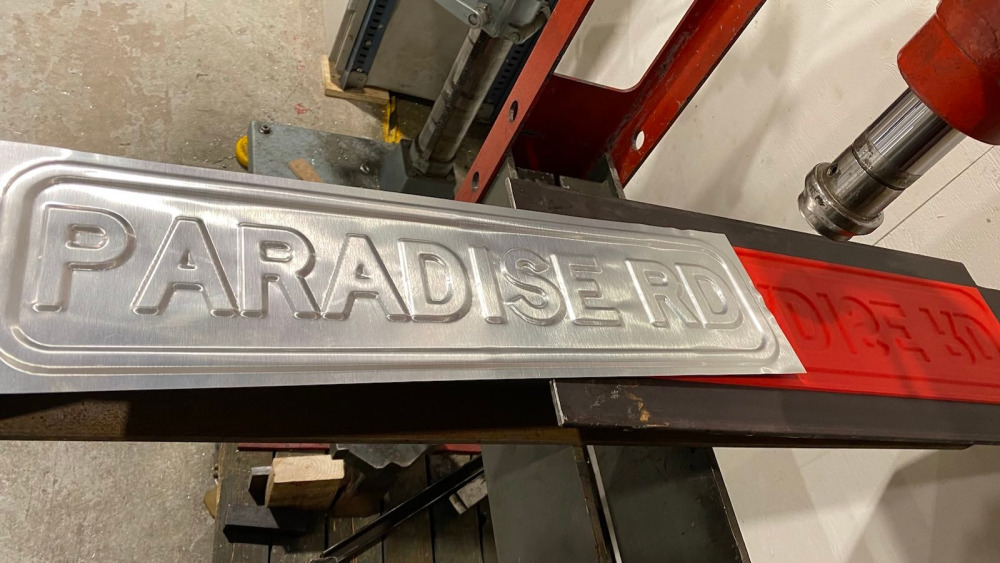
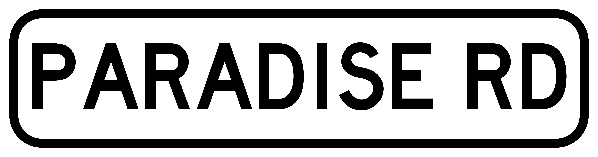

# Sheet stamp die maker

So you want to press form some sheet metal? Maybe creating an oldschool road sign or similar?
Like in this picture:



That is what this tool is for. It takes a black and white image as input, and outputs two grayscale images
representing the height map of the positive and negative press forms. You can then generate 3d models from
these height maps and proceed to manufacture the forms in some way. For example by 3d printing, or CNC-milling
in wood.

The sign in the image above was created out of a 0.7mm steel sheet with press forms 3d printed in ASA plastic.
The fade distance from high to low was set to 4.5mm, and the depth of the punch out was 2.5mm.

## How to build

1. Install Rust. IMHO best done via https://rustup.rs/
1. Compile with optimization: `cargo build --release`
1. Find the resulting binary at `./target/release/sheet-stamp-die-maker`

## How to use

1. Figure out how thick sheet you will use. The software will need this parameter to know how large
   gap to generate between the negative and positive forms. This is controlled via the `--sheet-thickness`
   argument.

   I have personally only tried this with up to 0.7 mm steel sheets, with 3d printed forms (ASA).
   That worked surprisingly well. But I can't say up to what sheet thickness and material 3d printed forms
   can handle. It also depends on how sharp edges you want the sign to have
   (this is controlled via `--fade-distance` later)

1. Create a black and white image with the shape you want to create. Black is the part that sticks out,
   and white is the "background". Make sure to think about the resolution. A good default to aim for is
   10 pixels per mm. So for a 100x80mm large sign make the image 1000x800 pixels (can be configured with
   the --pixels-per-mm argument later).

   This is the input image used to create the sign in the image at the top of this readme:
   

1. Run this tool:
   ```
   ./sheet-stamp-die-maker my-image.png \
       --pixels-per-mm 10
       --punch-out-depth 2.5
       --fade-distance 4.5
       --sheet-thickness 0.7
   ```

1. Take the output files (`my-image.negative.png` and `my-image.positive.png`) and create 3d models.
   This can for example be done via services such as https://imagetostl.com/create-3d-heightmap.
